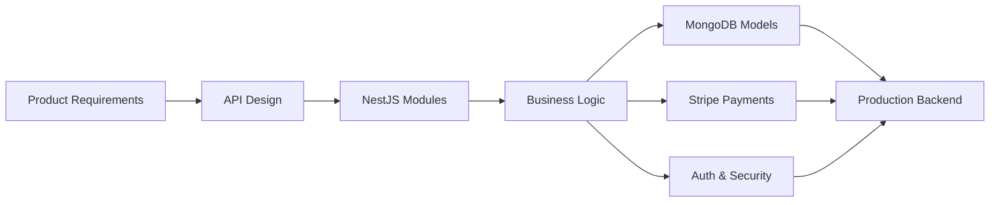

<p align="center">
  
</p>

<p align="center">
  <a href="https://git.io/typing-svg">
    
  </a>
</p>

<p align="center">
  <a href="https://www.linkedin.com/in/farouk-chtioui-/">
    
  </a>
  <a href="https://github.com/Farouk-chtioui">
    
  </a>
  <a href="mailto:farouk.chtioui.it@gmail.com">
    
  </a>
</p>

<p align="center">
  
  
  
</p>

---

## Backend Engineer Building Production Systems

I am a backend-focused software engineer based in Sousse, Tunisia, working mainly with **NestJS**, **TypeScript**, **GraphQL**, **MongoDB**, and **Stripe**.

I focus on building backend systems that are secure, maintainable, scalable, and ready for real production environments. My work is centered around clean architecture, reliable payment flows, API design, database consistency, security, and backend logic that supports real users and real business operations.

```txt
> system.identity

name       : Farouk Chtioui
role       : Backend-Focused Software Engineer
location   : Sousse, Tunisia
stack      : NestJS, TypeScript, GraphQL, MongoDB, Stripe
focus      : APIs, payments, clean architecture, reliability
goal       : Build systems that scale beyond local development
```

---

## Engineering Identity

<p align="center">
  
  
  
  
</p>



---

## GitHub Performance

<p align="center">
  
</p>

<p align="center">
  
  
</p>

<p align="center">
  
</p>

<p align="center">
  
</p>

---

## Contribution Flow

<p align="center">
  
</p>

---

## Core Backend Stack

### Languages

<p>
  
  
  
</p>

### Backend

<p>
  
  
  
  
</p>

### Database & Infrastructure

<p>
  
  
  
  
</p>

### Frontend Experience

<p>
  
  
</p>

### Payments & Security

<p>
  
  
  
  
  
  
</p>

---

## Production Backend Toolkit

| Area             | What I Work On                                                   |
| ---------------- | ---------------------------------------------------------------- |
| API Architecture | GraphQL APIs, REST APIs, module boundaries, DTOs, validation     |
| Payments         | Stripe Payment Sheet, Stripe Connect, wallets, payouts, webhooks |
| Security         | JWT, OAuth, guards, authorization, webhook signatures            |
| Database         | MongoDB schemas, indexing, query optimization, consistency       |
| Reliability      | Idempotency, clean error handling, service separation            |
| Product Systems  | Dashboards, CMS platforms, mobile-linked products, admin tools   |

---

## Professional Experience

### Backend Engineer — DunDill

**Jul 2025 – Present**

* Build and maintain backend services using **NestJS**, **TypeScript**, **GraphQL**, and **MongoDB**
* Work on payment systems involving **Stripe**, wallet flows, payouts, webhook verification, and idempotent operations
* Design backend logic for social, financial, and product-facing features
* Improve reliability, maintainability, and structure across backend modules and services
* Collaborate on production features involving dashboards, mobile apps, and backend infrastructure

---

### End-of-Year Intern — Full-Stack Web & Mobile — DunDill

**Oct 2024 – Jul 2025**

* Built and improved a CMS dashboard used to generate and manage mobile applications
* Developed backend features supporting APK generation, dashboard operations, and app management workflows
* Improved frontend live preview functionality and backend integration logic
* Worked on security improvements, validation flows, and API reliability

---

### Full-Stack Intern — DunDill

**May 2024 – Sep 2024**

* Contributed to backend APIs and frontend features for operational and delivery-related workflows
* Improved routing logic and reduced redundant routes across application flows
* Worked on performance-oriented improvements and cleaner backend structure
* Gained practical experience shipping real features in a production-oriented environment

---

## Selected Work

<table>
  <tr>
    <td width="33%">
      <h3 align="center">Social App Backend</h3>
      <p align="center">
        GraphQL backend supporting social features, payments, wallet logic, messaging, and user interactions.
      </p>
    </td>
    <td width="33%">
      <h3 align="center">AGB Transport</h3>
      <p align="center">
        Transport and supply-chain-oriented solution with backend and operational logic improvements.
      </p>
    </td>
    <td width="33%">
      <h3 align="center">APP BUILDER PRO</h3>
      <p align="center">
        CMS/SaaS platform for generating and managing mobile applications from a dashboard.
      </p>
    </td>
  </tr>
</table>

---

## Backend Principles I Follow

```txt
Controller   -> receives request only
Service      -> owns business logic
Repository   -> owns data access
DTO          -> validates input
Guard        -> protects access
Webhook      -> verifies source before action
Payment Flow -> must be idempotent
```

I care about:

* Backend code that is easy to read, test, debug, and extend
* APIs that are stable, predictable, and product-friendly
* Payment flows with correct webhook verification and idempotency handling
* Business logic organized inside services, not hidden inside controllers
* Performance through better queries, caching, and clean data access
* Features that work in real environments, not only in local development

---

## Education & Certifications

### B.Sc. in Computer Software Engineering — EPI

**Sep 2022 – Jul 2025**

### Certifications & Programs

* Google Cloud Big Data & Machine Learning Fundamentals
* MLOps: Getting Started
* Algorithmic Toolbox
* Version Control
* IEEEXtreme 17.0 Participation

---

## Current Direction

I am currently strengthening my expertise in:

<p>
  
  
  
  
  
</p>

My long-term goal is to become the type of engineer who can build systems that are not only functional, but reliable, scalable, secure, and valuable at real company scale.

---

## Connect With Me

<p align="center">
  <a href="https://www.linkedin.com/in/farouk-chtioui-/">
    
  </a>
  <a href="mailto:farouk.chtioui.it@gmail.com">
    
  </a>
</p>

<p align="center">
  
</p>
