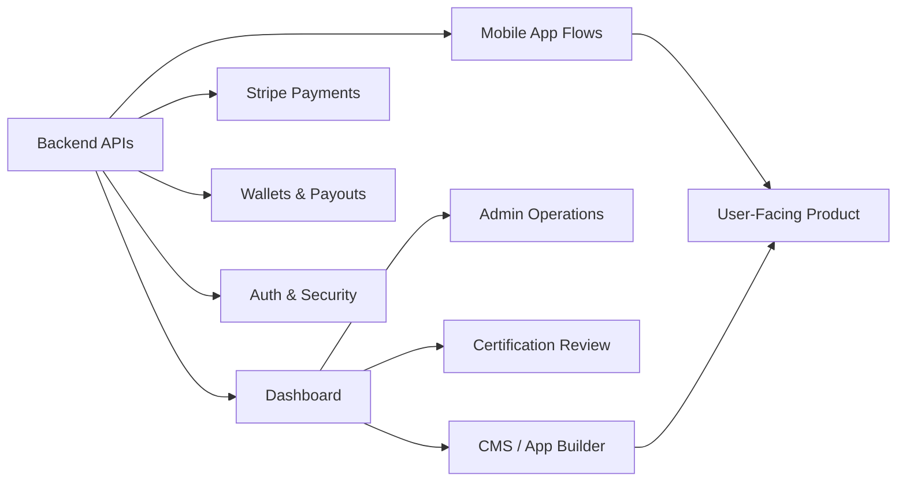

<p align="center">
  
</p>

<p align="center">
  <a href="https://git.io/typing-svg">
    
  </a>
</p>

<p align="center">
  <a href="https://www.linkedin.com/in/farouk-chtioui-/">
    
  </a>
  <a href="https://github.com/Farouk-chtioui">
    
  </a>
  <a href="mailto:farouk.chtioui.it@gmail.com">
    
  </a>
</p>

<p align="center">
  
  
  
</p>

---

## About Me

I am a backend-focused software engineer based in Sousse, Tunisia.

Most of my work is around **NestJS**, **TypeScript**, **GraphQL**, **MongoDB**, and **Stripe**. I work on backend systems, admin dashboards, and mobile-linked product flows where the backend is connected to real product features, payment logic, moderation tools, and operational dashboards.

I like working close to the product, not only writing isolated endpoints. My focus is to build backend logic that is clear, reliable, secure, and maintainable when the project grows.

```txt
name       : Farouk Chtioui
role       : Backend-Focused Software Engineer
location   : Sousse, Tunisia
stack      : NestJS, TypeScript, GraphQL, MongoDB, Stripe
focus      : APIs, payments, dashboards, mobile-linked workflows
```

---

## What I Work On

<p align="center">
  
  
  
  
</p>



---

## GitHub Activity

<p align="center">
  
</p>

<p align="center">
  
  
</p>

<p align="center">
  
</p>

<p align="center">
  
</p>

<p align="center">
  
</p>

---

## Contribution Flow

<p align="center">
  
</p>

---

## Core Stack

### Languages

<p>
  
  
  
</p>

### Backend

<p>
  
  
  
  
  
</p>

### Database & Infrastructure

<p>
  
  
  
  
  
  
</p>

### Frontend & Dashboard

<p>
  
  
  
  
  
</p>

### Payments & Security

<p>
  
  
  
  
  
  
</p>

---

## Professional Experience

### Backend Engineer — DunDill

**Jul 2025 – Present**

I work across the DunDill ecosystem with a strong focus on backend systems, dashboard features, and mobile-linked product workflows.

**Backend work:**

* Build and maintain backend features using **NestJS**, **TypeScript**, **GraphQL/Apollo**, and **MongoDB/Mongoose**
* Work on payment-related flows using **Stripe**, including payment handling, wallet logic, payouts, webhook verification, and idempotent operations
* Contribute to authentication and protected flows using **JWT**, OAuth-related integrations, guards, validation, and secure API patterns
* Improve backend reliability through cleaner services, better error handling, structured schemas, and maintainable module design
* Work with background-processing and infrastructure-oriented tools such as queues, schedulers, caching, and production scripts
* Add and maintain tests for critical backend logic and edge cases

**Dashboard work:**

* Build and improve internal/admin dashboard features using **React**, **Apollo Client**, **Material UI**, routing, charts, calendars, and data-driven interfaces
* Connect dashboard screens to GraphQL APIs and backend workflows
* Improve moderator/admin workflows, certification views, counters, notifications, and operational interfaces
* Work on UX improvements for complex backend actions such as validation, rollback flows, correction history, and audit visibility

**Mobile-linked product work:**

* Support mobile product features through backend APIs, dashboard configuration, and app-management workflows
* Work on systems connected to mobile app generation, user-facing app behavior, APK/app configuration, and CMS-driven mobile features
* Help connect backend logic, dashboard controls, and mobile-facing product requirements into one complete product flow

---

### End-of-Year Intern — Full-Stack Web & Mobile — DunDill

**Oct 2024 – Jul 2025**

* Built and improved dashboard features for managing mobile-linked applications and CMS-driven app configuration
* Worked on backend APIs supporting app management, generated mobile apps, and dashboard operations
* Improved frontend live-preview behavior and backend integration logic
* Contributed to security, validation, API reliability, and product workflow improvements
* Worked across backend, dashboard, and mobile-connected features instead of only isolated frontend tasks

---

### Full-Stack Intern — DunDill

**May 2024 – Sep 2024**

* Contributed to backend APIs and frontend features for operational product workflows
* Improved routing logic, reduced duplicated routes, and helped clean up application flows
* Worked on backend performance and better structure across delivery/product logic
* Gained practical experience shipping features inside a real production-oriented codebase

---

## Repository Spotlight

<p align="center">
  <a href="https://github.com/mehry-aya/dundill-developer-backend">
    
  </a>
  <a href="https://github.com/mehry-aya/dundill-developer-frontend">
    
  </a>
</p>

<p align="center">
  <a href="https://github.com/bahriovich/dundill-react-ing">
    
  </a>
</p>

---

## Selected DunDill Work

<table>
  <tr>
    <td width="33%">
      <h3 align="center">Backend Platform</h3>
      <p align="center">
        NestJS backend powering GraphQL APIs, authentication, payments, wallet logic, user flows, certification logic, and dashboard-connected operations.
      </p>
      <p align="center">
        
        
        
        
      </p>
    </td>
    <td width="33%">
      <h3 align="center">Admin Dashboard</h3>
      <p align="center">
        React dashboard connected to backend APIs for operational workflows, admin actions, statistics, certification handling, counters, and product management.
      </p>
      <p align="center">
        
        
        
        
      </p>
    </td>
    <td width="33%">
      <h3 align="center">Mobile-Linked Product</h3>
      <p align="center">
        Product workflows connecting backend services, dashboard controls, app configuration, APK/mobile app management, and mobile-facing business logic.
      </p>
      <p align="center">
        
        
        
        
      </p>
    </td>
  </tr>
</table>

---

## Product Areas

```txt
DunDill Backend
├── GraphQL APIs
├── MongoDB / Mongoose schemas
├── Stripe payments and webhooks
├── Wallets, payouts, and payment reliability
├── Authentication and protected flows
├── Certification and moderation logic
├── Background jobs and scheduled logic
└── Tests and backend reliability

DunDill Dashboard
├── React admin/developer interfaces
├── Apollo Client integration
├── Statistics, counters, and operational views
├── Certification and moderation screens
├── CMS / app-management workflows
├── Charts, calendars, and dashboard UI
└── Backend-connected admin actions

DunDill Mobile-Linked Workflows
├── Mobile app configuration
├── APK/app management flows
├── CMS-driven mobile features
├── Mobile-facing backend APIs
└── Product logic shared between backend, dashboard, and app
```

---

## Backend Principles

```txt
Controller   -> receives request only
Service      -> owns business logic
Repository   -> owns data access
DTO          -> validates input
Guard        -> protects access
Webhook      -> verifies source before action
Payment Flow -> must be idempotent
```

I care about:

* Clear backend structure
* Stable APIs
* Secure payment flows
* Clean service boundaries
* Practical error handling
* Reliable dashboard actions
* Features that survive real usage, not only local testing

---

## Education & Certifications

### B.Sc. in Computer Software Engineering — EPI

**Sep 2022 – Jul 2025**

### Certifications & Programs

* Google Cloud Big Data & Machine Learning Fundamentals
* MLOps: Getting Started
* Algorithmic Toolbox
* Version Control
* IEEEXtreme 17.0 Participation

---

## Currently Improving

<p>
  
  
  
  
  
</p>

---

## Connect With Me

<p align="center">
  <a href="https://www.linkedin.com/in/farouk-chtioui-/">
    
  </a>
  <a href="mailto:farouk.chtioui.it@gmail.com">
    
  </a>
</p>

<p align="center">
  
</p>
